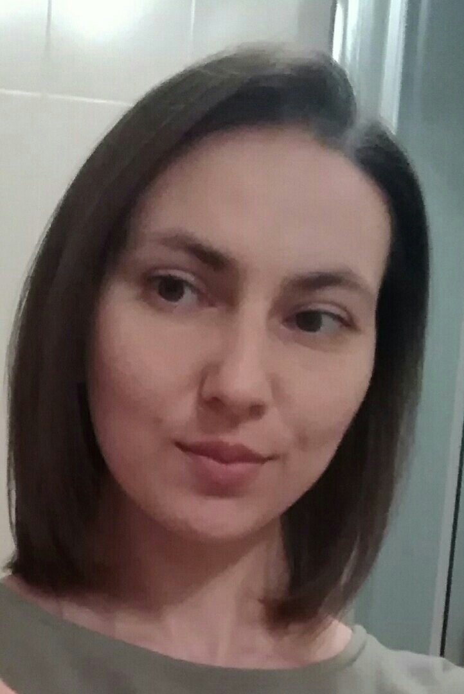

# Hello and welcome!

### My name is Irina Orekhova. I'm obsessed learning frontend developing.

**<u>My current skills are:</u>**

- HTML;
- CSS;
- Responsive sites;
- Basics of JavaScript;
- Git

_My favourite quote is_

> Learning through the entire life is what people are expected to do to achieve their best in what they are doing.

My portfolio:

1. (https://irinaore.github.io/mq-diploma/)
